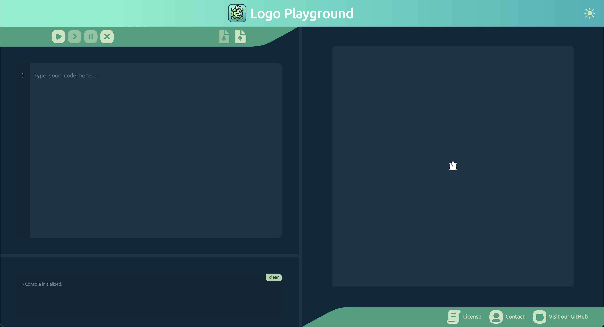

.. _introduction:

Introduction
============

``python-logo`` is a project created for the *Innovative Projects by Nokia* subject at the `University of Wroclaw (UWR) <https://rekrutacja.uni.wroc.pl/kierunek/informatyka-i-stopnia-stacjonarne-licencjackie-i-inzynierskie>`_.
It features:

- A `Logo <https://en.wikipedia.org/wiki/Logo_(programming_language)>`__ language interpreter
- A `Flask <https://flask.palletsprojects.com/en/stable>`__ backend
- A `Svelte <https://svelte.dev>`__ frontend

.. note::
   This doc is based on the README file from the project's repository.

Features
--------

- **TO-DO**
